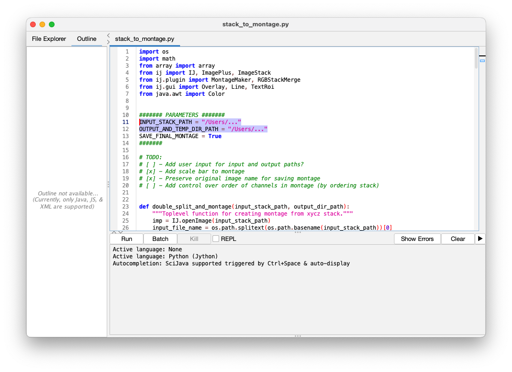

# FIJI Stack to Montage

Spencer J Rothfuss, Vanderbilt University

This script takes a multi-color z-series file as input and turns it into a 2D montage with each color in a row and each z position in a column.
Also, it adds a scale bar!

## Before Running

Use FIJI (or another tool) to crop image to desired size (`Image > Crop`), remove unwanted slices (`Image > Stacks > Delete Slice`), and save with LUTs applied (`Image > Adjust > Brightness/Contrast`).
The script expects a `xycz` `.tif` or `.nd2`.
In other words, a z-series with multiple color channels.

## Import and Run Script

>NOTE: This script is designed to be run _**inside FIJI**_ not in a standard Python IDE.

To add the script to FIJI, drag `stack_to_montage.py` into the FIJI Main Window.
It will open in the FIJI script editor.
From there, edit file paths appropriately.

You must specify `OUTPUT_AND_TEMP_DIR_PATH` to use for saving temporary files, even if you elect not to save the final montage.

Click Run!

## Example

