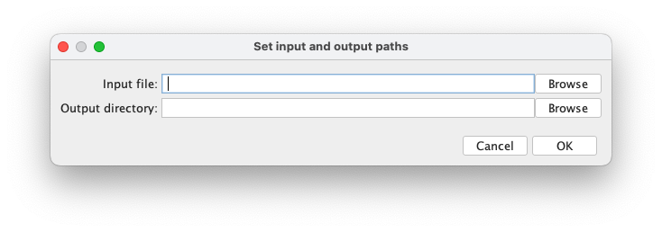

# FIJI Stack to Montage

Spencer J Rothfuss, Vanderbilt University

This script takes a multi-color z-series file as input and turns it into a 2D montage with each color in a row and each z position in a column.
Also, it adds a scale bar!

## Before Running

Use FIJI (or another tool) to crop image to desired size (`Image > Crop`) and save with LUTs applied (`Image > Adjust > Brightness/Contrast`).
The script expects a `xycz` `.tif` or `.nd2`.
In other words, a z-series with multiple color channels.

## Import and Run Script

>NOTE: This script is designed to be run _**inside FIJI**_ not in a standard Python IDE.

1. Drag `stack_to_montage.py` into the FIJI Main Window and the script will open in the FIJI script editor.
1. Click Run!
1. Dialog boxes will open to ask you to select input file and output directory and select which slices to include in the montage.

## Example

